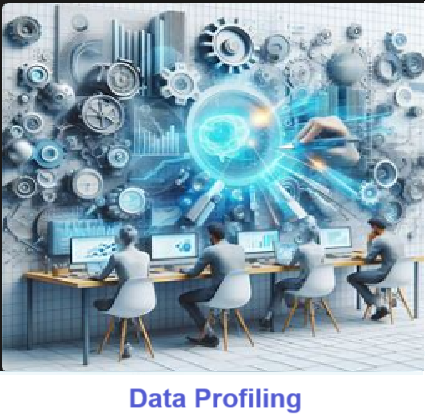

    
# Descriptive Statistics 

## process used to analyze the data. 

    

    
## Table of Contents

- [Solution Overview](#solution-overview)
- [Who will use this ?](#who-can-use)
- [Advantages of Using](#advantages-of-using)
- [Return on Investment (ROI)](#return-on-investment-roi)
- [How it Works](#how-it-works)
- [Conclusion](#conclusion)
- [Getting Started](#getting-started)
- [Solution Features](#solution-features)
- [Code Features](#code-features)
- [Deliverables or Figures](#deliverables-or-figures)
- [Contact Information](#contact-information)

**Descriptive statistics** serve as a fundamental tool for data scientists to comprehend the characteristics of their datasets, enabling them to uncover patterns and trends. By summarizing key features such as central tendency and variability, descriptive statistics offer concise insights into the distribution of data, facilitating informed decision-making and hypothesis testing. Ultimately, their utilization empowers data scientists to extract meaningful interpretations and communicate findings effectively to stakeholders, driving informed actions and solutions.

**Descriptive statistics** involve methods for summarizing and describing the features of the entire dataset. 

Statistics includes measures such as **mean, median, and mode** for **central tendency**, as well as measures like **standard deviation** and range for dispersion or spread. 

These statistics offer insights into the **distribution, variability, and characteristics** of the data, aiding in understanding and interpreting its underlying patterns and trends.

    

    
## Getting Started

The goal of this solution is to **Jump Start** your development and have you up and running in 30 minutes. 

To get started with the **Descriptive Statistics** solution repository, follow these steps:
1. Clone the repository to your local machine.
2. Install the required dependencies listed at the top of the notebook.
3. Explore the example code provided in the repository and experiment.
4. Run the notebook and make it your own - **EASY !**
    
## Solution Features

- Easy to understand and use  
- Easily Configurable 
- Quickly start your project with pre-built templates
- Its Fast and Automated
- Saves You Time 

## Code Features

These features are designed to provide everything you need for **Descriptive Statistics** 

- **Self Documenting** - Automatically identifes major steps in notebook 
- **Self Testing** - Unit Testing for each function
- **Easily Configurable** - Easily modify with **config.INI** - keyname value pairs
- **Includes Talking Code** - The code explains itself 
- **Self Logging** - Enhanced python standard logging   
- **Self Debugging** - Enhanced python standard debugging
- **Low Code** - or - No Code  - Most solutions are under 50 lines of code
- **Educational** - Includes educational dialogue and background material

    
## List of Figures
                      
    

## Github https://github.com/JoeEberle/ - Email  josepheberle@outlook.com 
    

    